<div align="center">


<br/>

<a href="https://git.io/typing-svg"></a>

<br/>

<table align="center">
<tr>
<td align="center" width="100%">


</td>
</tr>
</table>

<br/>

<div align="center">
<table>
<tr>
<td>

### 🎯 **Philosophy**
> *"Maybe you don't know everything."*

### ⚡ **Fun Fact**
> *"I think I am funny."*

</td>
</tr>
</table>
</div>

<br/>


<br/>

## 📡 **IDENTITY MATRIX**
```ascii
┌──────────────────────────────────────────────────────┐
│  USER@GITHUB:~$ whoami                               │
│  > Sajid Mahmud Sayan                                │
│                                                      │
│  USER@GITHUB:~$ locate --profile                    │
│  > Full Stack Developer                             │
│  > Python Specialist                                │
│  > AI & Machine Learning Enthusiast                 │
│  > 19 Years Old | Bangladesh 🇧🇩                     │
│                                                      │
│  USER@GITHUB:~$ cat current_focus.txt               │
│  > 🐍 Python Mastery                                 │
│  > 📊 Data Science & Analytics                       │
│  > 💻 C++ Systems Programming                        │
│                                                      │
│  USER@GITHUB:~$ echo $MOTTO                         │
│  > "Maybe you don't know everything."               │
│                                                      │
│  USER@GITHUB:~$ ls alternate_accounts/              │
│  > @sajidsayan                                       │
│                                                      │
│  USER@GITHUB:~$ systemctl status productivity       │
│  ● Active: Learning & Exploring                     │
│  ● Mode: Not working on new projects                │
│  ● Focus: Deep Skill Development                    │
└──────────────────────────────────────────────────────┘
```

<br/>


<br/>

## 🏆 **ACHIEVEMENT SHOWCASE**

<div align="center">

</div>

<br/>


<br/>

## 🌐 **CONNECT WITH ME**

<div align="center">

<a href="mailto:sayan@sajidsayan.work.gd">

</a>

<a href="https://discord.gg/NMd2yupUve">

</a>

<a href="https://facebook.com/sajidmahmudsayansayan">

</a>

<a href="https://instagram.com/sajid_sayan25">

</a>

<a href="https://youtube.com/@ihek.official">

</a>

<a href="https://github.com/sajidsayan">

</a>

</div>

<br/>


<br/>

## 💼 **TECHNOLOGY ARSENAL**

### **Frontend Development**

<div align="center">

<table>
<tr>
<td align="center" width="96">

<br>HTML5
</td>
<td align="center" width="96">

<br>CSS3
</td>
<td align="center" width="96">

<br>JavaScript
</td>
<td align="center" width="96">

<br>React
</td>
<td align="center" width="96">

<br>Tailwind
</td>
<td align="center" width="96">

<br>Bootstrap
</td>
<td align="center" width="96">

<br>Figma
</td>
</tr>
</table>

</div>

### **Backend Development**

<div align="center">

<table>
<tr>
<td align="center" width="96">

<br>Python
</td>
<td align="center" width="96">

<br>Django
</td>
<td align="center" width="96">

<br>Flask
</td>
<td align="center" width="96">

<br>PHP
</td>
<td align="center" width="96">

<br>Node.js
</td>
<td align="center" width="96">

<br>MySQL
</td>
<td align="center" width="96">

<br>SQLite
</td>
<td align="center" width="96">

<br>Firebase
</td>
</tr>
</table>

</div>

### **AI & Data Science**

<div align="center">

<table>
<tr>
<td align="center" width="96">

<br>TensorFlow
</td>
<td align="center" width="96">

<br>PyTorch
</td>
<td align="center" width="96">

<br>Scikit-learn
</td>
<td align="center" width="96">

<br>NumPy
</td>
<td align="center" width="96">

<br>Pandas
</td>
<td align="center" width="96">

<br>Matplotlib
</td>
<td align="center" width="96">

<br>Anaconda
</td>
</tr>
</table>

</div>

### **DevOps & Tools**

<div align="center">

<table>
<tr>
<td align="center" width="96">

<br>Git
</td>
<td align="center" width="96">

<br>GitHub
</td>
<td align="center" width="96">

<br>VS Code
</td>
<td align="center" width="96">

<br>Linux
</td>
<td align="center" width="96">

<br>Vercel
</td>
<td align="center" width="96">

<br>Netlify
</td>
<td align="center" width="96">

<br>Cloudflare
</td>
</tr>
</table>

</div>

<br/>


<br/>

## 🚀 **FEATURED PROJECTS**

<div align="center">

<table width="100%">
<tr>
<td width="50%">

### 🎙️ **Audgen**


**Description:** Voice generator web application with advanced text-to-speech capabilities

**Tech Stack:**
- HTML5 / CSS3 / JavaScript
- Web Audio API
- Responsive Design

**Links:**
- 🌐 [Live Demo](https://audgen.pages.dev)

---

</td>
<td width="50%">

### 🤖 **Pyrex**


**Description:** AI and Machine Learning experimentation project exploring cutting-edge algorithms

**Tech Stack:**
- Python
- TensorFlow / PyTorch
- Data Science Libraries

**Links:**
- 💻 [Repository](https://github.com/aurasqlm/pyrex)

---

</td>
</tr>
<tr>
<td width="50%" colspan="2">

### 🌟 **Nexa**


**Description:** Personal portfolio website showcasing projects and skills with modern design

**Tech Stack:**
- React
- Tailwind CSS
- Vercel Hosting

**Links:**
- 🌐 [Live Site](https://nexa.unaux.com)

---

</td>
</tr>
</table>

</div>

<br/>


<br/>

## 📊 **ANALYTICS DASHBOARD**

<div align="center">


</div>

<br/>

<div align="center">

</div>

<br/>

<div align="center">
<picture>
  <source media="(prefers-color-scheme: dark)" srcset="https://raw.githubusercontent.com/aurasqlm/aurasqlm/output/github-contribution-grid-snake-dark.svg">
  <source media="(prefers-color-scheme: light)" srcset="https://raw.githubusercontent.com/aurasqlm/aurasqlm/output/github-contribution-grid-snake.svg">
  
</picture>
</div>

<br/>


<br/>

## 🎯 **CURRENT FOCUS**

<div align="center">

<table>
<tr>
<td align="center" width="33%">

### 🐍 Python Mastery
Deep diving into advanced Python concepts, design patterns, and best practices

</td>
<td align="center" width="33%">

### 📊 Data Science
Exploring statistical analysis, machine learning algorithms, and data visualization

</td>
<td align="center" width="33%">

### 💻 C++ Programming
Building strong foundations in systems programming and performance optimization

</td>
</tr>
</table>

<br/>

**Status:** 🔴 Not actively working on new projects — **Currently in deep learning mode**

</div>

<br/>


<br/>

## 💡 **DAILY INSPIRATION**

<div align="center">


<br/><br/>


</div>

<br/>


<br/>

<details>
<summary><b>🖥️ SYSTEM SPECIFICATIONS & HARDWARE</b></summary>

<br/>

<div align="center">

<table>
<tr>
<td>

**⚙️ Primary Development Machine**
```yaml
OS: Linux / Windows Dual Boot
Processor: High-Performance Multi-Core
RAM: 16GB DDR4
Storage: 512GB NVMe SSD
GPU: Dedicated Graphics for ML/AI Tasks
Display: Full HD IPS Panel
```

</td>
<td>

**🛠️ Development Environment**
```yaml
IDE: VS Code, PyCharm
Terminal: Zsh with Oh My Zsh
Version Control: Git + GitHub CLI
Containerization: Docker
Package Managers: pip, npm, yarn
Virtualization: VirtualBox, WSL2
```

</td>
</tr>
</table>

<br/>

**📱 Additional Devices**
- Mobile Development Testing on Android & iOS
- Tablet for UI/UX Design Reviews
- Cloud Development Environments for Remote Work

</div>

</details>

<br/>


<br/>

## 📈 **CONTRIBUTION METRICS**

<div align="center">


<br/>


</div>

<br/>


<br/>

## 🌟 **SPOTLIGHT ACHIEVEMENTS**

<div align="center">

<table>
<tr>
<td align="center" width="25%">

<br/><b>Total Projects</b>
</td>
<td align="center" width="25%">

<br/><b>Total Commits</b>
</td>
<td align="center" width="25%">

<br/><b>Experience</b>
</td>
<td align="center" width="25%">

<br/><b>Specialization</b>
</td>
</tr>
</table>

</div>

<br/>


<br/>

## 🎓 **LEARNING JOURNEY**

<div align="center">


</div>

<br/>


<br/>

```mermaid
graph LR
    A[Web Development] --> B[Full Stack]
    B --> C[Backend Specialization]
    C --> D[Python Expertise]
    D --> E[AI & ML]
    E --> F[Data Science]
    F --> G[Current Focus]
    
    style A fill:#0d1117,stroke:#00f2ff,stroke-width:2px,color:#fff
    style B fill:#0d1117,stroke:#00f2ff,stroke-width:2px,color:#fff
    style C fill:#0d1117,stroke:#00f2ff,stroke-width:2px,color:#fff
    style D fill:#0d1117,stroke:#00f2ff,stroke-width:2px,color:#fff
    style E fill:#0d1117,stroke:#00f2ff,stroke-width:2px,color:#fff
    style F fill:#0d1117,stroke:#00f2ff,stroke-width:2px,color:#fff
    style G fill:#00f2ff,stroke:#00f2ff,stroke-width:3px,color:#000
```

## 📚 **SKILLS BREAKDOWN**

<div align="center">

| **Category** | **Skills** | **Proficiency** |
|:---:|:---:|:---:|
| **Frontend** | HTML, CSS, JavaScript, React |  |
| **Backend** | Python, Django, Flask, Node.js |  |
| **Database** | MySQL, SQLite, Firebase |  |
| **AI/ML** | TensorFlow, PyTorch, Scikit-learn |  |
| **Data Science** | NumPy, Pandas, Matplotlib |  |
| **DevOps** | Git, GitHub, Linux, Cloud Platforms |  |
| **Design** | Figma, UI/UX Principles |  |

</div>

<br/>


<br/>

## 🤝 **COLLABORATION & OPEN SOURCE**

<div align="center">

**Open to collaborate on:**
- 🤖 AI/ML Projects
- 🌐 Full Stack Web Applications
- 📊 Data Science Initiatives
- 🔬 Research & Experimentation
- 📱 Mobile App Development

<br/>


</div>

<br/>


<br/>

## 📫 **GET IN TOUCH**

<div align="center">

<table>
<tr>
<td align="center">

**💼 Professional Inquiries**

[sayan@sajidsayan.work.gd](mailto:sayan@sajidsayan.work.gd)

</td>
<td align="center">

**💬 Community & Chat**

[Discord Server](https://discord.gg/NMd2yupUve)

</td>
</tr>
<tr>
<td align="center">

**📱 Social Media**

[Facebook](https://facebook.com/sajidmahmudsayansayan) • [Instagram](https://instagram.com/sajid_sayan25)

</td>
<td align="center">

**🎥 Content Creation**

[YouTube - @ihek.official](https://youtube.com/@ihek.official)

</td>
</tr>
</table>

<br/>

**Response Time:** Usually within 24-48 hours ⚡

</div>

<br/>


<br/>

## 💭 **VISITOR'S GUESTBOOK**

<div align="center">

<a href="https://github.com/aurasqlm/aurasqlm/issues/new?title=Hi%20Sajid!&body=Leave%20your%20message%20here">

</a>

</div>

<br/>


<br/>

<div align="center">

### 🌠 **Thank you for visiting!**


<br/><br/>

**⭐ If you like my work, consider starring my repositories!**

<br/>


<br/><br/>

---

<br/>


<sub>© 2025 SajiMahmud Sayan • All Rights Reserved</sub>
</div>
<br/>

</div>
